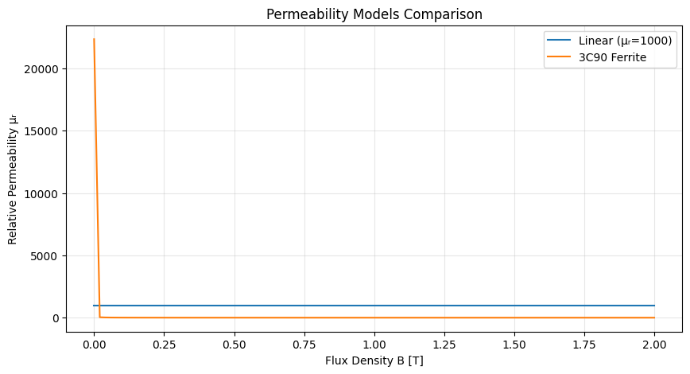

# Permeability Models


<!-- WARNING: THIS FILE WAS AUTOGENERATED! DO NOT EDIT! -->

## Executive Summary

**Purpose:** Provide nonlinear reluctance models for MEC solver

**What it does:** Implement permeability models for magnetic materials.

### Why It Matters

MEC solver needs reluctance(flux) relationships; these models provide
that.

### Quick Start

**Inputs:** Material properties, flux density

**Outputs:** Reluctance values for magnetic circuit analysis

## How It Fits Into the Motor Design Workflow

**Upstream (depends on):** Used by 04_mec_solver.ipynb to compute
magnetic circuit

**Downstream (used by):** See notebook connections

## Theory: Magnetic Permeability

Magnetic permeability μ relates flux density **B** to field strength
**H**:

*B* = *μ* ⋅ *H* = *μ*<sub>0</sub> ⋅ *μ*<sub>*r*</sub> ⋅ *H*

where: - *μ*<sub>0</sub> = 4*π* × 10<sup>−7</sup> H/m is permeability of
free space - *μ*<sub>*r*</sub> is relative permeability (material
property)

For nonlinear materials, permeability changes with B. The MEC solver
requires both: 1. *μ*(*B*) — permeability at flux density B 2.
$\frac{d\mu}{dB}$ — derivative for Newton-Raphson linearization

------------------------------------------------------------------------

### PermeabilityModel

``` python
def PermeabilityModel(
    *args, **kwargs
):
```

*Abstract interface for permeability models used by the MEC solver.*

## Linear Permeability Model

For linear materials (no saturation), permeability is constant:

*μ*(*B*) = *μ*<sub>0</sub> ⋅ *μ*<sub>*r*</sub>
$$\frac{d\mu}{dB} = 0$$

This applies to air gaps and weakly magnetic materials.

------------------------------------------------------------------------

### LinearPermeabilityModel

``` python
def LinearPermeabilityModel(
    mu_r:float=1.0
)->None:
```

*Constant permeability μ = μ₀ · μᵣ.*

## Spline Permeability Model

For nonlinear materials with measured B-H curves, fit a cubic spline:

$$\mu(B) = \mu_0 \cdot \frac{H(B)}{B}$$

The spline provides both μ(B) and its derivative dμ/dB for
Newton-Raphson.

**Assumption:** Data starts at origin (H=0, B=0)\
**Symmetry:** Negative B uses odd symmetry: μ(-B) = μ(B)

    /usr/local/lib/python3.10/site-packages/fastcore/docscrape.py:259: UserWarning: Unknown section Class Methods
      else: warn(msg)

------------------------------------------------------------------------

### SplinePermeabilityModel

``` python
def SplinePermeabilityModel(
    H_data, # Sequence[float]
    B_data, # Sequence[float]
)->None:
```

*Permeability model built from tabulated B-H data via a cubic spline.*

The data are assumed to start at (H=0, B=0). Negative-B evaluation uses
odd symmetry: μ(−|B|) = μ(|B|), dμ/dB(−|B|) = −dμ/dB(|B|).

## Shane-Sudhoff Analytical Model

Analytical model published in: \> Shane, S.D. & Sudhoff, S.D. (2010).
“Refinements in Anhysteretic Characterization and Permeability
Modeling.” IEEE Trans. Magn., 46(11).

The model uses an auxiliary function f(B) with piecewise exponential
terms:

$$f(B) = \frac{\mu_r}{\mu_r - 1} + \sum_n \left\[ a_n |B| + d_n \log(e_n + z_n e^{-b_n |B|}) \right\]$$

where derived constants are: -
*d*<sub>*n*</sub> = *a*<sub>*n*</sub>/*b*<sub>*n*</sub> -
*z*<sub>*n*</sub> = (*γ*<sub>*n*</sub> − 1)/*γ*<sub>*n*</sub> -
*e*<sub>*n*</sub> = 1 − *z*<sub>*n*</sub>

Then:
$$\mu(B) = \mu_0 \cdot \frac{f}{f - 1}$$

------------------------------------------------------------------------

### ShanesudhoffModel

``` python
def ShanesudhoffModel(
    mu_r:float, a, # Sequence[float]
    b, # Sequence[float]
    gamma, # Sequence[float]
    mu0:float | None=None
)->None:
```

*Shane-Sudhoff (2010) analytical permeability model.*

## Example: Compare Permeability Models

``` python
# Create models
linear = LinearPermeabilityModel(mu_r=1000)
ferrite = ShanesudhoffModel.ferrite_3C90()

# Sample B values
B_range = np.linspace(0, 2.0, 100)

# Evaluate models
mu_linear = np.array([linear.mu(B) for B in B_range])
mu_ferrite = np.array([ferrite.mu(B) for B in B_range])

# Plot
plt.figure(figsize=(10, 5))
plt.plot(B_range, mu_linear / 4e-7 / np.pi, label='Linear (μᵣ=1000)')
plt.plot(B_range, mu_ferrite / 4e-7 / np.pi, label='3C90 Ferrite')
plt.xlabel('Flux Density B [T]')
plt.ylabel('Relative Permeability μᵣ')
plt.legend()
plt.grid(True, alpha=0.3)
plt.title('Permeability Models Comparison')
plt.show()
```



## Tests

``` python
# Test LinearPermeabilityModel
mu0 = 4e-7 * np.pi
mu_r = 1000
linear = LinearPermeabilityModel(mu_r=mu_r)

assert linear.mu(0.5) == mu0 * mu_r, "Linear model should be constant"
assert linear.dmu_dB(0.5) == 0.0, "Linear model derivative should be zero"

# Test with mu_r=1 (free space)
air = LinearPermeabilityModel(mu_r=1.0)
assert air.mu(1.0) == mu0, "Free space permeability incorrect"

print("✓ LinearPermeabilityModel tests passed")

# Test ShanesudhoffModel
ferrite = ShanesudhoffModel.ferrite_3C90()

# At B=0, should return μ₀·μᵣ
mu_at_0 = ferrite.mu(0.0)
mu_r_initial = mu_at_0 / mu0
assert mu_r_initial > 1000, "Initial permeability should be high"

# Check that permeability decreases with increasing B (saturation)
mu_0_1 = ferrite.mu(0.1)
mu_1_0 = ferrite.mu(1.0)
assert mu_1_0 < mu_0_1, "Ferrite should saturate"

# Verify odd symmetry of derivative
df_pos = ferrite.dmu_dB(0.5)
df_neg = ferrite.dmu_dB(-0.5)
assert np.isclose(df_pos, -df_neg), "Derivative should have odd symmetry"

print("✓ ShanesudhoffModel tests passed")

# Test error handling
try:
    bad_linear = LinearPermeabilityModel(mu_r=0)
    assert False, "Should reject non-positive mu_r"
except ValueError:
    print("✓ Error handling tests passed")
```

    ✓ LinearPermeabilityModel tests passed
    ✓ ShanesudhoffModel tests passed
    ✓ Error handling tests passed
